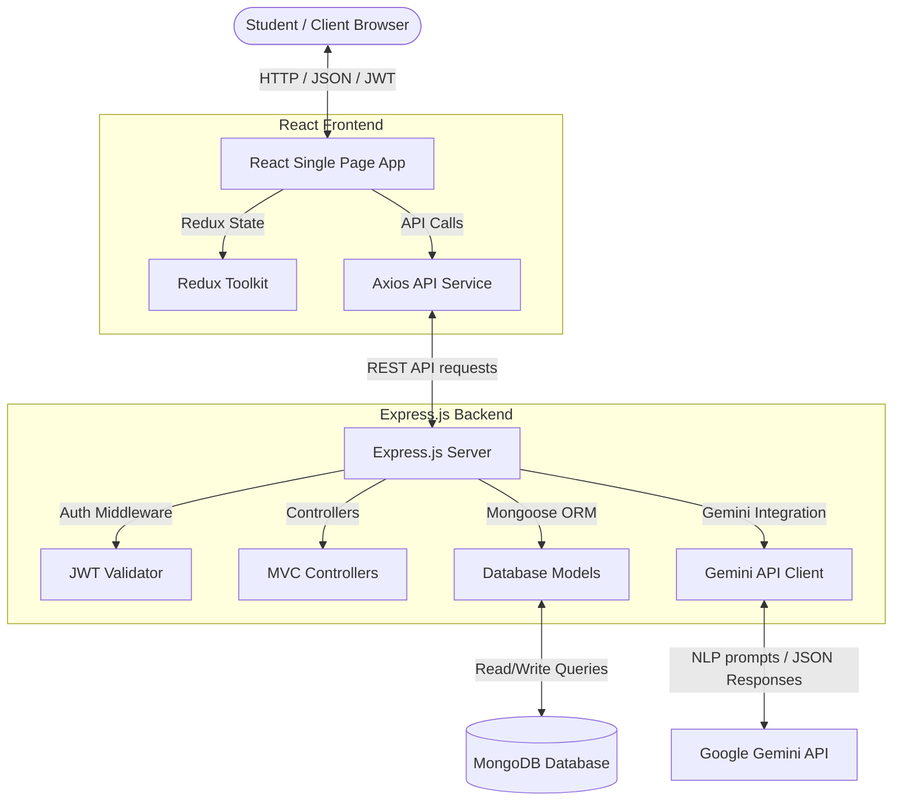
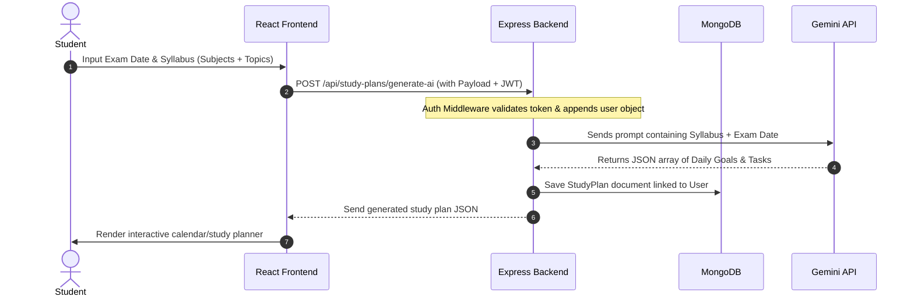

# 🏛️ System Architecture

This document describes the high-level system architecture of **OpenPrep AI**. It outlines the core components, layout patterns, and data flows that power the platform.

---

## 🔍 System Overview

OpenPrep AI is structured as a decoupled, multi-tier system composed of:
1. **Frontend (Client-Tier)**: A single-page application (SPA) built using React, Vite, and Tailwind CSS.
2. **Backend (Server-Tier)**: A RESTful API built using Node.js and Express.js.
3. **Database (Data-Tier)**: A document database using MongoDB for persistent storage, integrated via the Mongoose ORM.
4. **AI Layer (Integration-Tier)**: The Gemini API service layer (`gemini-1.5-flash`) for heavy academic NLP analysis, planning, and content generation.



---

## 🔄 High-Level Data Flow

### 📅 AI Study Plan Generation Flow



---

## 📂 Detailed Folder Structure

The directory layout is designed to strictly separate client logic, server logic, database schemas, and documentation.

```bash
OpenPrep-AI/
├── backend/                       # Server-side codebase
│   ├── config/                    # Configuration settings (e.g., db.js)
│   ├── controllers/               # Route controllers (logic handler mapping)
│   ├── middleware/                # Route filters (protect, upload, error)
│   ├── models/                    # Mongoose database models (User, PYQ, etc.)
│   ├── routes/                    # Express API route endpoints
│   ├── services/                  # Business logic (Gemini API interactions)
│   ├── .env.example               # Template environment configuration file
│   ├── Dockerfile                 # Docker setup for backend service
│   ├── package.json               # Backend dependencies and startup scripts
│   └── server.js                  # Main server entrypoint
│
├── frontend/                      # Client-side codebase
│   ├── public/                    # Static public assets (icons, manifests)
│   ├── src/
│   │   ├── assets/                # Images, stylesheets, SVGs
│   │   ├── components/            # Reusable UI component modules
│   │   ├── context/               # Global state contexts (e.g., ThemeContext)
│   │   ├── services/              # API clients & network utilities
│   │   ├── store/                 # Redux Toolkit global store & slices
│   │   ├── App.css                # Component styling rules
│   │   ├── App.jsx                # Router configuration & view manager
│   │   ├── index.css              # Global styles & Tailwind base directives
│   │   └── main.jsx               # React virtual DOM entrypoint
│   ├── tailwind.config.js         # Tailwind styling utility configuration
│   ├── vite.config.js             # Vite development server settings
│   └── package.json               # Frontend dependencies and packaging scripts
│
└── docs/                          # Project documentation directory
```
