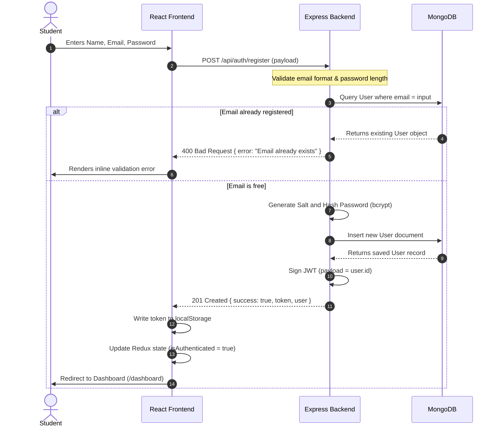
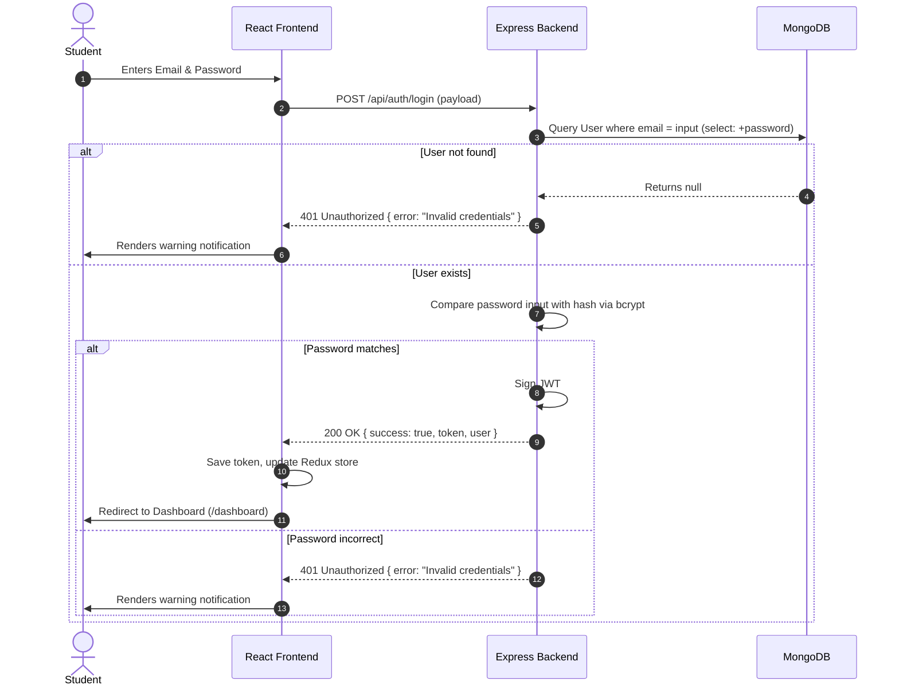
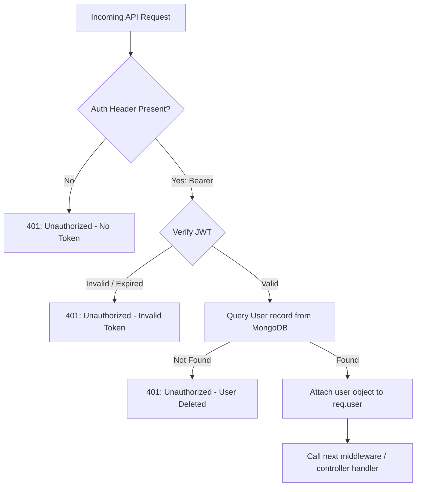

# 🔑 Authentication Flow

This document details the security and authentication flows implemented in **OpenPrep AI**.

---

## 🔒 JWT Security Strategy

OpenPrep AI uses JSON Web Tokens (JWT) for authentication. 
* **Hashing Algorithm**: `HMAC-SHA256` via the `jsonwebtoken` package.
* **Token Lifetime**: 30 days (configured in controllers on login/registration).
* **Storage Location**: Client `localStorage` under the key `token`.
* **Payload Structure**:
```json
{
  "id": "60d0fe4f5311236168a109a1",
  "iat": 1782059349,
  "exp": 1784651349
}
```

---

## 🔄 User Registration Flow

The registration flow establishes new user accounts, hashes credentials, and starts an active session:



---

## 🔄 User Login Flow



---

## 🛡️ Route Protection Flow (API & UI)

### 1. API Route Guards (Backend)
Private Express routes are chained through the `protect` middleware:

```javascript
// backend/routes/quizRoutes.js
router.post('/generate-ai', protect, generateAIQuiz);
```



### 2. UI Route Guards (Frontend)
Private pages are shielded from guest access using [ProtectedRoute.jsx](file:///c:/Users/Nishit/OneDrive/Desktop/ALL%20Projects/OPENPREP%20AI/OpenPrep-AI/frontend/src/components/ProtectedRoute.jsx).
1. Upon browser load/refresh, the client dispatches the `loadUser` async thunk.
2. If `localStorage.getItem('token')` is set:
   * It sends a `GET /api/auth/me` request with the token.
   * If the request is successful, the Redux store is populated with `user` data and `isAuthenticated` becomes `true`.
   * If the request fails (e.g., token expired), it deletes the token from local storage, resets state, and redirects to `/login`.
3. If no token is found, accessing protected paths redirects immediately to `/login`.
