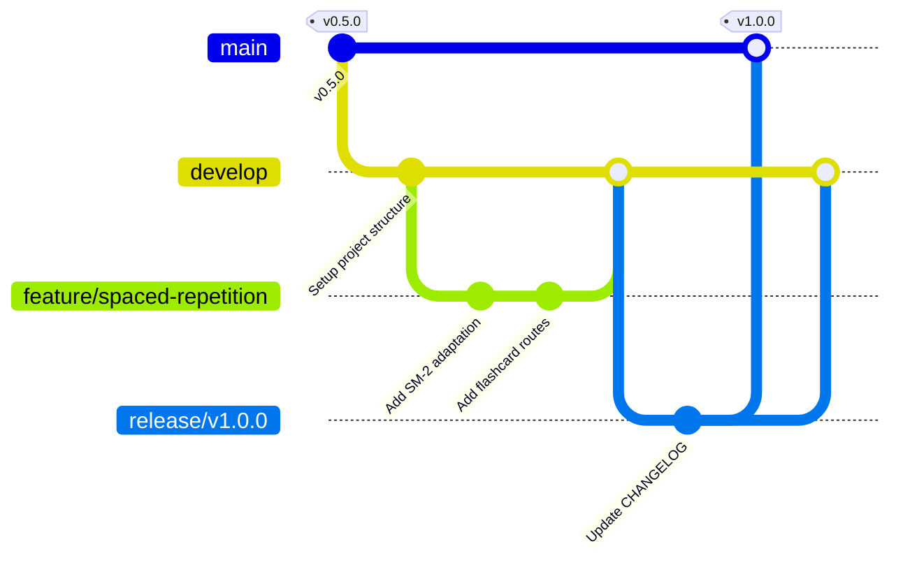

# 🌿 Branching Strategy

To manage contributions, releases, and feature changes without code conflicts, **OpenPrep AI** adopts a structured Git branching strategy based on the **Git Flow** workflow.

---

## 🔱 Branch Definitions

Our repository maintains two permanent branches and three types of temporary branch workflows:



### 1. Main Branches (Permanent)
* **`main`**: Represents production-ready code. Commits on `main` are restricted strictly to merges from release or hotfix branches. Every merge to `main` is tagged with a semantic version number (e.g., `v1.0.0`).
* **`develop`**: Represents integration workspace for developers. Daily code updates, approved features, and test results are consolidated here.

### 2. Supporting Branches (Temporary)
* **`feature/*`**: Used for developing new features. Branch off from `develop` and merge back into `develop` once complete and approved.
* **`bugfix/*`**: Used for fixing bugs found in development or staging. Branch off from `develop` and merge back into `develop`.
* **`hotfix/*`**: Used for fixing critical bugs in production. Branch off directly from `main`, apply the patch, and merge back to both `main` and `develop`.
* **`release/*`**: Used to prepare code for a production release. Branch off from `develop`, perform final testing/bug-fixing, update versions/changelogs, and merge to `main` and `develop`.

---

## 🏷️ Branch Naming Conventions

Always prefix branch names with their type, followed by a slash and a short, descriptive hyphenated name:

* **Feature**: `feature/user-auth-redux` or `feature/pyq-ocr`
* **Bugfix**: `bugfix/jwt-expiration-loop` or `bugfix/cors-headers`
* **Hotfix**: `hotfix/db-connection-reconnect`
* **Release**: `release/v1.0.0` or `release/v1.5.0`

---

## 🚀 Release Process

1. **Cut a Release Branch**: When features on `develop` are ready for release, cut a new branch:
   ```bash
   git checkout develop
   git pull origin develop
   git checkout -b release/v1.0.0
   ```
2. **Version Bump & Changelog Update**:
   * Bump versions in `package.json` files.
   * Update [CHANGELOG.md](file:///c:/Users/Nishit/OneDrive/Desktop/ALL%20Projects/OPENPREP%20AI/OpenPrep-AI/CHANGELOG.md) to log modifications, additions, and bug fixes under the release header.
3. **Run Code Verification**: Run tests, check linters, and ensure the build succeeds.
4. **Merge and Tag**:
   * Merge the release branch into `main`:
     ```bash
     git checkout main
     git merge release/v1.0.0
     git tag -a v1.0.0 -m "Release version 1.0.0"
     git push origin main --tags
     ```
   * Merge back into `develop` to sync version changes:
     ```bash
     git checkout develop
     git merge release/v1.0.0
     git push origin develop
     ```
   * Delete the temporary `release/v1.0.0` branch.
