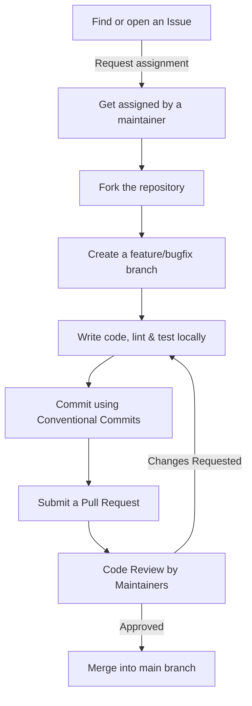

# 🤝 Contribution Guide

Welcome to the **OpenPrep AI** contributor community! This document provides detailed guidelines to help you contribute effectively to our codebase, documentation, or design assets.

---

## 🗺️ Contribution Workflow

We follow a structured Git workflow to maintain code quality:

---

## 🔱 Branching and Pull Request Guidelines

### 1. Branch Naming Conventions
* **Features**: `feature/short-description` (e.g., `feature/spaced-repetition`)
* **Bug Fixes**: `bugfix/short-description` (e.g., `bugfix/quiz-timer-leak`)
* **Documentation**: `docs/short-description` (e.g., `docs/troubleshooting-vps`)
* **Chore/Cleanups**: `chore/short-description` (e.g., `chore/bump-dependencies`)

### 2. Pull Request Requirements
Before submitting your Pull Request, ensure that:
* Your branch is updated with the latest upstream `main` changes.
* All dependencies compile and local services launch without warnings.
* Linting standards are met (run `npm run lint` in both `frontend` and `backend`).
* You write descriptive commit messages following the Conventional Commit syntax.
* Your PR links directly to the issue it resolves (e.g., include `Closes #42` in your PR description).

---

## 💻 Coding & Formatting Standards

We enforce code formatting rules to keep the codebase clean:
* **Prettier**: Ensure you have a Prettier plugin active in your editor or run code formatters before committing. We use [`.prettierrc`](file:///c:/Users/Nishit/OneDrive/Desktop/ALL%20Projects/OPENPREP%20AI/OpenPrep-AI/.prettierrc) rules.
* **ESLint**: We enforce code sanity and quality rules. Review [`.eslintrc.json`](file:///c:/Users/Nishit/OneDrive/Desktop/ALL%20Projects/OPENPREP%20AI/OpenPrep-AI/.eslintrc.json) for specific rules.

---

## 📝 Documenting Changes

If your contribution adds new features or alters database/API schemas:
1. Update `docs/database-schema.md` or `docs/api-reference.md` as necessary.
2. Document new setup flags in `docs/setup-guide.md`.
3. Highlight any new dependencies added.

---

## 💬 Community & Support

Need help? Join the conversation:
* **GitHub Issues**: Best for bug reporting or specific feature discussions.
* **Discussions**: Best for open-ended architecture suggestions or troubleshooting setup steps.
* **Email Support**: For security vulnerability disclosures, email us directly at **security@openprep.ai**.
* **CoC**: Remember to read and follow the terms in our [Code of Conduct](file:///c:/Users/Nishit/OneDrive/Desktop/ALL%20Projects/OPENPREP%20AI/OpenPrep-AI/CODE_OF_CONDUCT.md) during all communications.
