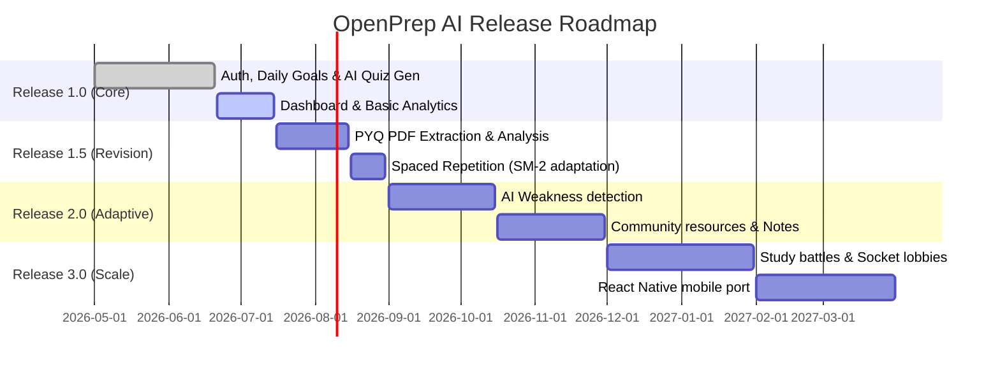

# 🗺️ Technical Project Roadmap

This document outlines the detailed feature milestones, release phases, and technical upgrades scheduled for **OpenPrep AI**.

---

## 🚀 Release Milestones & Tech Spec Breakdown

---

## 📌 Milestone Details

### Phase 1: Version 1.0 — Core Platform (Active)
**Objective**: Build the foundational web platform for exam prep and AI content generation.
* **Authentication**: JWT validation, login/register forms, secure token caching.
* **Academic Catalog**: Mongoose schemas to store Exams, Subjects, and Topics.
* **AI Study Plan Generator**: Integrates the Gemini API (`gemini-1.5-flash`) to generate structured lists of daily study tasks based on user exam dates and availability.
* **AI Quiz Generator**: Generates MCQ sets for specific subjects/topics from note inputs or general syllabus fields.
* **Dashboard**: Track study hours, streaks, and basic activity logs.

---

### Phase 2: Version 1.5 — PYQ Intelligence & Memorization (Q3 2026)
**Objective**: Automate past question paper analysis and introduce memory retention systems.
* **PYQ Intelligence Engine**:
  * Implement PDF file parsing on the backend using `pdf-parse` or similar libraries.
  * Send parsed text data to the Gemini API to identify recurring questions, determine chapter weightage, and output trending topics.
* **Flashcards & Spaced Repetition**:
  * Integrate the **SuperMemo SM-2** spaced repetition algorithm.
  * Adjust card review intervals dynamically based on user feedback grades (0 to 5 rating scale).
* **Analytics Upgrades**: Add visual performance charts (line graphs for scores over time, topic mastery heatmaps).

---

### Phase 3: Version 2.0 — Adaptive AI Mentorship (Q4 2026)
**Objective**: Shift from static scheduling to smart, adaptive study feedback loops.
* **AI Weakness Detection Engine**:
  * Run periodic background jobs to aggregate students' quiz performance data.
  * Flag topics as 'Weak', 'Medium', or 'Strong' dynamically in the database.
* **Adaptive Study Planner**: Reschedule daily tasks automatically to allocate more study hours to weak areas.
* **Community Resource Hub**: Allow students to publish flashcard decks and revision notes, enabling community sharing.
* **Advanced Document Parsing**: OCR (Optical Character Recognition) capabilities to read screenshots of question papers or handwritten notes.

---

### Phase 4: Version 3.0 — Social Learning & Mobile App (Q1 2027)
**Objective**: Improve engagement through gamification and multi-device access.
* **Study Battles**:
  * Live competitive quiz rooms using WebSockets (`Socket.io`).
  * Live leaderboards, achievements, and peer challenges.
* **Mobile Port**: Wrap the React code or build a dedicated **React Native** application targeting iOS and Android devices.
